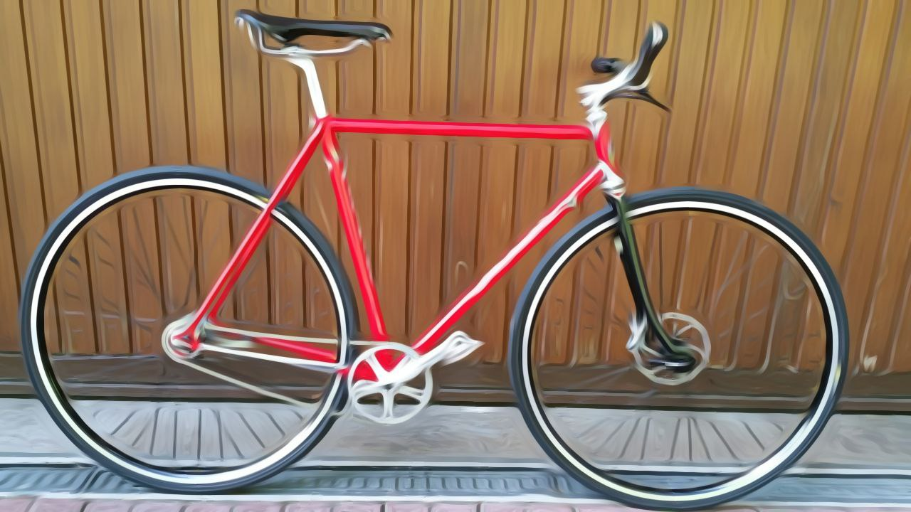



# Colnago 2B666

<a href="https://www.instagram.com/velominds/">instagram</a>  <a href="https://www.pinterest.ch/velominds/circular-concept-iii/">pinterest</a> 

<small> 
Components
–frame: Colnago 80's Columbus Acciaio 54cm
–fork: Handcrafted with polished stainless steel crown by Andres Arregui (http://arreguivelazquez.com/) 
–rims: Mavic endurance A719
–spokes: Sapim race black
–hub front: Sram X0 QR 
–hub rear + cog: Sram automatix 2 gears coaster brake
–tire: Mavic Yksion elite all road 700x30c
–stem: GOrilla
–handlebar: Renthal fatbar lite 35mm gold
–headset: Shimano durace
–front disc brake: Sram Via hydraulic GT
–crankset: Shimano durace 42pt
-grips: Renthal lock-on ultra tacky
-crankset axle: Shimano durace
–chain: Sedis
-cog: Sturmey Archer polished 19pt
–pedal: Shimano durace
–saddle: Brooks swallow
–seatpost: Shimano durace
</small>

