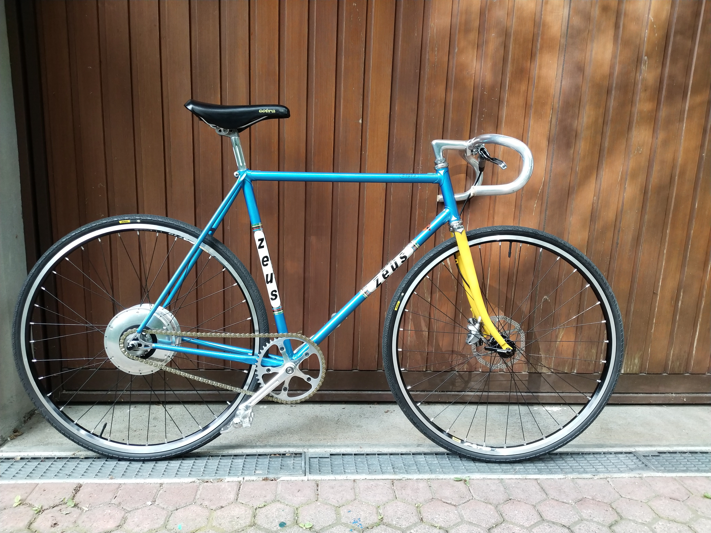



# Tigra114262 



<a href="https://www.instagram.com/velominds/">Tigra 114262</a>  <a href="https://www.pinterest.ch/velominds/circular-concept-iii/">Zeus TH123 pictures</a> 

```
Components
* frame: Zeus pista from the 80's with Reynolds SMS tube
* fork: Handcrafted and disc brake ready with polished stainless steel crown by Andres Arregui (http://arreguivelazquez.com/)
* rims: Mavic endurance A719 – spokes: Sapim race black – 
* hub front: Sram X0 QR
* hub rear + cog: Zehus Bike+. BIKE+ does need a minimum charge. Likewise hybrid cars the system can optimize the rider’s energy while riding, reducing the pedaling effort up to 40%.  BIKE+ is able to flatten soft-hills thanks to the Zehus slope sensor. The hub has a full electric assistance for more than 30 kms -- Check it out all the features in th following link  http://www.zehus.it/products/
* tires: WTB Riddler 700 x 37c
* stem: Zeus 
* handlebar: 3ttt
* headset: Tange Levin
* handlebar tape: Benotto
* front disc brake: SRAM G2 Ultimate Disc Brake
* crankset: Featuring Zeus pista arms 165mm each and chainring Zeus pista 46t
* chain: Izumi
* pedal: Zeus * supercronos
* saddle: Condor
* seatpost: Zeus 2000 polished. 
```

