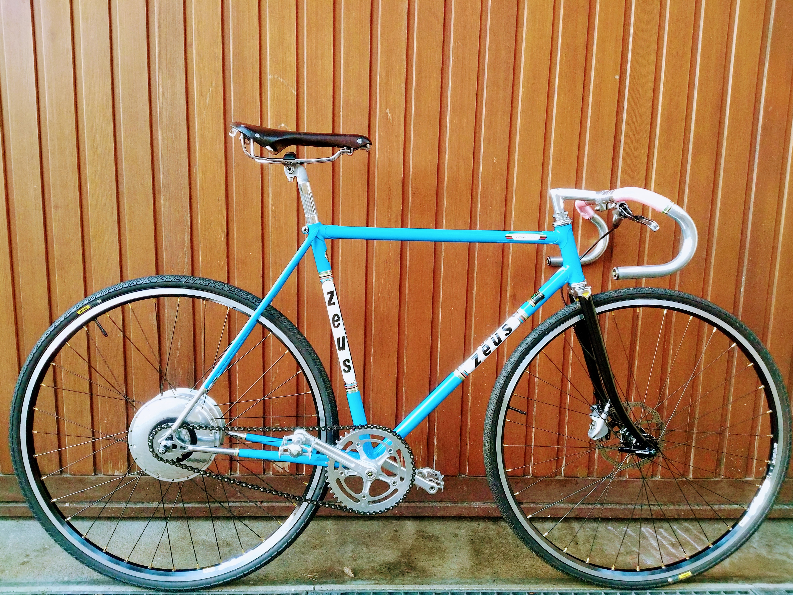



# ZeusTH000



<a href="https://www.instagram.com/velominds/">Zeus TH000 pictures</a>

<a href="https://www.pinterest.ch/velominds/circular-concept-iii/">Zeus TH000 pictures</a> 


```
Rental
Please for long term rental contact: 
velominds@gmail.com 
to discuss the rental procedure. 
```

```
Components
Zeus early 80 anil
* frame: Zeus pista eroica from the 80's with Reynolds 531 tube
* fork: Handcrafted with polished stainless steel crown by Andres Arregui (http://arreguivelazquez.com/) 
* rims: Mavic endurance A719
* spokes: Sapim race black
* hub front: Sram X0 QR 
* hub rear: Sram Automatix 2-gears
* rear cog: Sturmey Archer 22pt
* tire: Mavic Yksion elite all road 700x30c
* stem: GOrilla
* handlebar: Renthal fatbar lite gold 35mm
* headset: Tange Levin
* grip: Renthal lock-on ultra tacky
* front disc brake: Sram Via hydraulic GT
* crankset: Zeus pista 165mm and chainring Zeus pista 42t
* chain: Iris gold
* pedal: Zeus pista
* saddle: Zeus
* seatpost: Zeus 2000 polished

```

